## ECG Segmentation

Segmenting electrocardiogram (ECG) into its important components is crucial to the field of cardiology and
pharmaceutical studies, because analyses of ECG segments can be used to predict heart symptoms and the effects of cardiac
medications, as [1] says.  

ECG waves are divided into several categories, such as: *P* wave, *QRS* complex, *T* wave and lastly
*Extrasystole*. Additionally, we add an extra category to these samples which do not belong to any of
these given classes. ECG signal segmentation can be reinterpreted as a classification of each sample from the signal.  

The goal of this project is to train a neural network, which will be able to segment ECG signal per each sample into
given categories with high accuracy and reliable generalization wherever possible. 

Through the following sections, we will discuss how to get some insights from data,
how to preprocess them and prepare into a suitable structure for feeding the network.  
Next, we will discuss the neural network architectures along with their training and validation processes,
as well as the processes of testing and presenting results. 

<!--
#### Related Work
_TODO_
-->

#### Dataset Overview
_The data are not presented due to license agreement of data providers._

Our dataset is constructed from three different data sources - namely
_database#1_, _database#2_ and _database#3_.

Structure of `split.csv`:
```python
print(df.head(10))
```

```shell script
                                    name    Database  Patient Lead                filename
0    database#1/database#1_code_AVF.json  database#1   _code_  AVF     database#1_code_AVF
1    database#1/database#1_code_AVL.json  database#1   _code_  AVL     database#1_code_AVL
2      database#2/database#2_code_I.json  database#2   _code_    I       database#2_code_I
3     database#2/database#2_code_II.json  database#2   _code_   II      database#2_code_II
4    database#3/database#3_code_III.json  database#3   _code_  III     database#3_code_III
4    database#3/database#3_code_III.json  database#3   _code_  III     database#3_code_III
```


<!--                            |   5th Experiment  -->
<!---------------------------                 |--------------------------->
<!--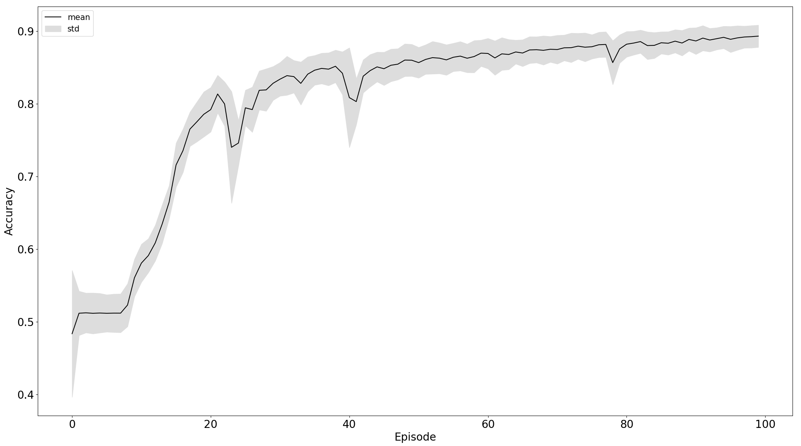      | -->

Since there are multiple sources, probably there can be also multiple
ways how the data was made. Script `preprocessing.py` checks this claim.

|                   | # ECG leads | sampling rate | # of patients | # lead types | # distinct ECG sizes        | min/max over all leads | total length  
--------------      |------------ | ------        | ------        | ------       | ------                     | ------                 | ------
|**database#1**      | 105         | ~112 Hz       | 12            | 12           | 228, 229, 230              | 10/83                  | 24 045
|**database#2**       | 157         | ~257 Hz       | 34            | 12           | 3 000, 5 000, 10 000       | -13.69/14.26           | 851 000
|**database#3**          | 29          | ~360 Hz       | 29            | 1            | 10 000                     | -2.34/2.59             | 290 000


Visualize short ECG sequences for each database to show how they are similar (or not).

**database#1**


**database#2**


**database#3**


The event of occurrences intervals between P and T waves differ in periodic length. Except for database#1
in the other two databases, it seems there is much more noise.  
So, by looking at table above, database#1 is probably a database with the highest quality for the price
of being the smallest one.


#### Preprocessing
ECG signal is a non-stationary (mean does not change over time) type of time-series data.
There are several different approaches how to preprocess a raw ECG signal. 
In short, this is a summary of various data preprocessing methods that people in the field are
commonly doing (according to our best knowledge):

- **Time-series analysis**
    - _differencing_ - to transform series from non-stationary to stationary one;
    - _median filter/smoothing_ - filtering noise;
    - _FSST (Fourier Synchrosqueezed Transform)_ - extract time-frequency features from signal as showing [4];

- **Domain-knowledge**
    - _Low (Baseline Wander - BWR) and High Frequencies_ - these methods remove useless features from data
    (e.g. patients breathing);

- **Arbitrary sampling rate**
    - work [2] presenting a novel approach of preprocessing the signal in the way that can be applied in network
    with arbitrary frequency;  

___

The data as they are, are not in suitable form to consume for to most of the models. The structure/form of the
data we change by choosing a fixed appropriate size of sequence length - _window_ and dividing the originate sequence by them,
we can construct a dataset of N samples of window length.  
The window should be not overlapping, because we are intending fitting the data by the sequence model,
which is implicitly capable of capture patterns of longer dependencies and it also lead to huge 
increasing of data. (Although it's a necessary step for some models.) 


#### The Models

**SegNet**  
Deep Learning model of our choice is **ECG-SegNet** based on LSTM network introduced in paper [1].
Its architecture is many-to-many and consist of two bidirectional LSTM hidden layer with tanh activation function
followed by two linear layer with ReLU activation. For regularization is Dropout used. Last layer is responsible for
reshaping the output. 

**Cnn-SegNet**  
To make the experiment more interesting, later we will try out an altered version of this network - Cnn-SegNet.  
We would like to realize following idea - use as the first layer in the network 1-dimensional convolutional layer
for "feature extraction" (which is designed for signal processing) and the rest of the network will remain the same.
Within this approach, later we will be inspiring with various sources from Literature. 


#### Experimental Setup

Here we describe in what way we have designed several baselines. Our first attempt is with the **SegNet** model.
Here, with this model, we are not interested in the manipulation of its parameters (neither hyper) we are interested
only in how various data preprocessing steps affect the model performance.

The baselines/experiments are the following:

1. Raw ECG data,
2. Normalized raw ECG data,
3. Standardized raw ECG data
4. Normalized raw ECG data + preprocessing with BWR,
5. Standardized raw ECG data + preprocessing with BWR,

Standardization is meant as [Z-Score](https://en.wikipedia.org/wiki/Standard_score). Normalization is also known in
sense of [rescaling](https://en.wikipedia.org/wiki/Feature_scaling#Rescaling_(min-max_normalization).  
BWR is Baseline Wander Removal filter method mentioned earlier.
  
Model expect for an input the matrix with a shape `N x T x F`, where:

- **N** is number of samples or sequences,
- **T** is length of single sequence,
- **F** is number of features.

Model has to generate an output in a shape `T x C`, where
- **T** is sequence length,
- **C** is number of classes. 

Without any preprocessing of the ECG data, number of features is equal one, `F = 1` (only raw data). With increasing
preprocessing steps we can make extend the dataset according to `F` dimension. In case of 4th and 5th experiments: `F = 2`. 

Sequence length of the input for LSTM network according to various literature is roughly recommended to value in range 200-400.
By looking at the graph of ECG signal above, particularly at the database Database#1 there is perhaps a need for longer
window that the model would be able to capture reasonable information even from a single sequence.  
But since we want to make things slightly easier at least at building the dataset, so we leave the size of the window to 220 lengths,
i.e. `windows_size = 220` - it's the minimal length of all leads in each database. 

Built dataset by joining all 3 data sources of 5459 sequences each of 220 timestamps, which is split into:
- **train set** - 75% 4166 sequences,
- **validation set** - 5% 258 sequences,
- **test set** - 20% 1035 sequences.  

All sets are mutually exclusive. The training loop is set for **100 episodes**. Learning algorithm for the **SegNet** network is **Adam** optimizer using
a **mini-batch** of size 32 and _**Cross-Entropy**_ is used as a _loss_ function.
After each epoch _validation error_ is compute. All the outputs of the loss function and weights of the model are stored after each episode.  
None of above the parameters was changing across the experiments.


***

#### Results

|                                    | SegNet     | CNN-SegNet
|------                              | ------     | ---------
|                                    |            |
|                                    |            |
|                                    | 0.901      | ---         
| 1. Experiment                      | 0.897      | ---
|                                    | 0.889      | ---
|                                    |            |
|                                    | ---        | ---         
| 2. Experiment                      | ---        | ---
|                                    | ---        | ---
|                                    |            |
|                                    | 0.902      | ---         
| 3. Experiment                      | 0.887      | ---
|                                    | 0.885      | ---
|                                    |            |
|                                    | ---        | ---         
| 4. Experiment                      | ---        | ---
|                                    | ---        | ---
|                                    |            |
|                                    | 0.942      | ---
| 5. Experiment                      | 0.919      | ---
|                                    | 0.922      | ---
|                                    |            |    

The results are obtained after training. From up-to-down are accuracy scores in
percentage for training, validation, and test set respectively. The score between raw and standardized
version of ECG signal are not so different, but when the model consumes it preprocessed is seems that
the performance of the model is getting better.

Demonstration of model performance for 5th experiment on several samples from **test set**:

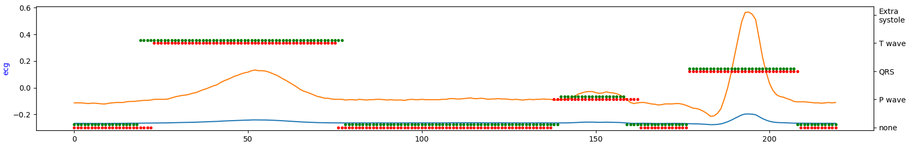

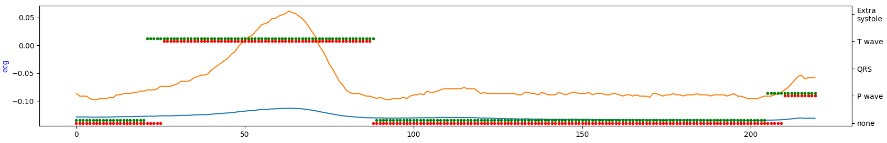

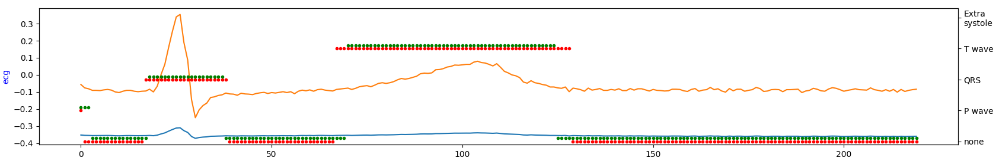

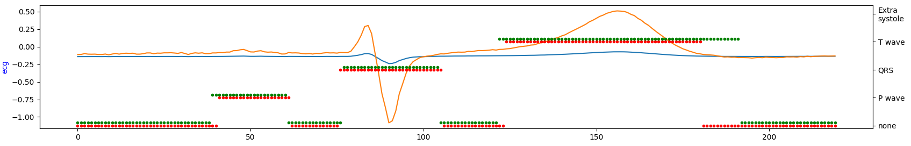

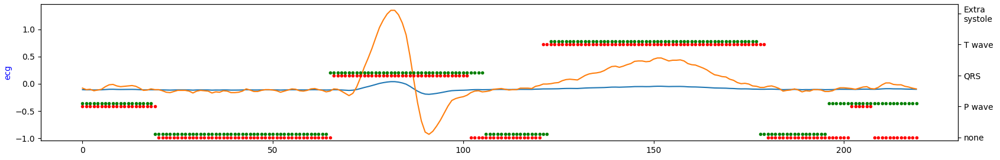

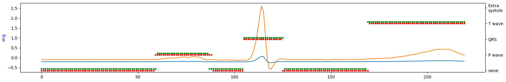

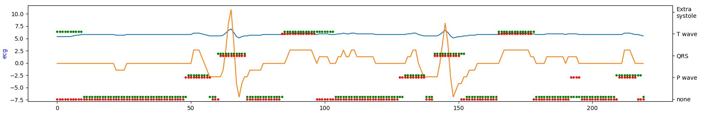

where:
- green = ground truth
- red = predicted
- orange = ECG signal
- blue = filtered signal by BWR


**Confusion Matrices**

_TODO_: Construct and visualize confusion matrix to see for which classes the model is lacking the power of predictivity.


**Learning Curves**

Comparison of training on standardized raw and preprocessed data, left and right respectively:  

3rd Experiment                            |   5th Experiment  
-------------------------                 |-------------------------
      | 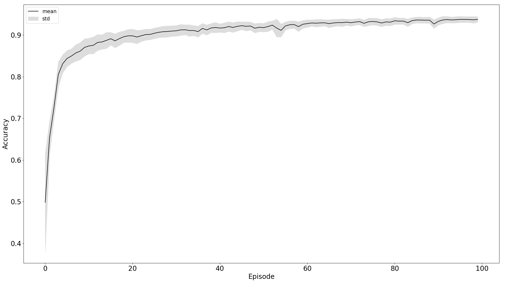
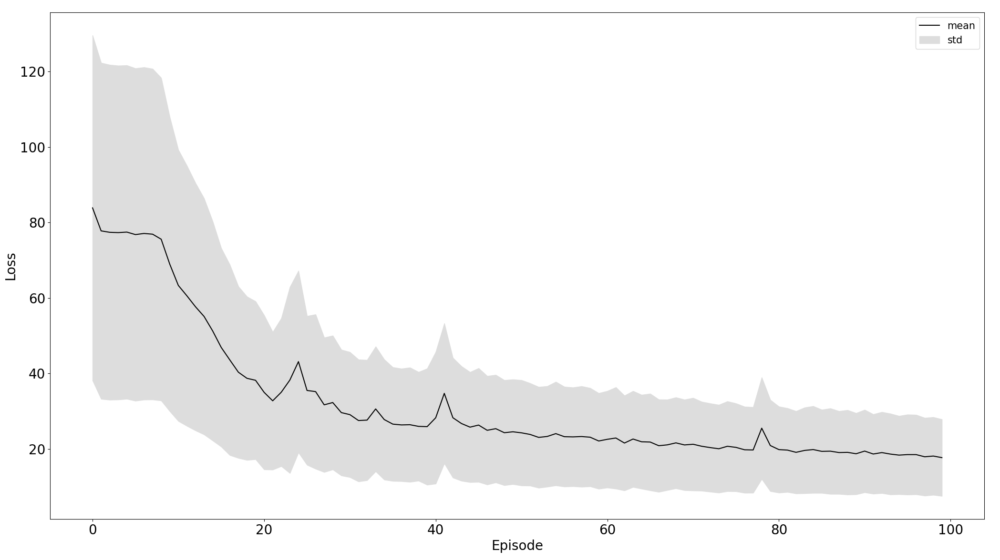     | 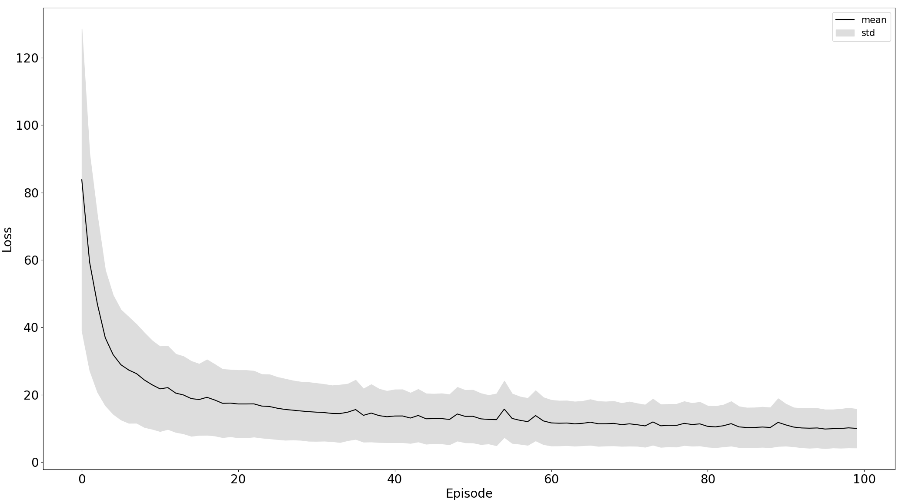

Black line is the mean of particular data - losss or accuracy and the grey area is the standard deviation to express stability of training.
From the plot, we can see that the model trained on the 5th experiment setup converges more stable and faster than in the third. 


#### Literature
[1] [Supervised ECG Interval Segmentation Using LSTM Neural Network](https://csce.ucmss.com/cr/books/2018/LFS/CSREA2018/BIC3264.pdf)  
[2] [Deep Learning for ECG Segmentation](https://arxiv.org/pdf/2001.04689.pdf)  
[3] [ECG Segmentation by Neural Networks: Errors and Correction](https://arxiv.org/pdf/1812.10386.pdf)  
[4] [Waveform Segmentation Using Deep Learning](https://www.mathworks.com/help/signal/examples/waveform-segmentation-using-deep-learning.html)  
[5] [ECG Signal Denoising and Features Extraction Using Unbiased FIR Smoothing](http://downloads.hindawi.com/journals/bmri/2019/2608547.pdf)  
[6] [A convolutional neural network based approach to QRS detection](https://www.researchgate.net/publication/320663526_A_convolutional_neural_network_based_approach_to_QRS_detection)  
[7] [Development of Neural Network-Based Approach for QRS Segmentation](https://ieeexplore.ieee.org/document/8981524)  


#### Implementation Detail/ Last Notes
- code is written in Python 3.8,
- every library used in the project is in **requirements.txt** file,
- the whole report should be reproducible,
- neural network is implemented in PyTorch.
- scripts are configured to dynamically determine whether to use computations on CPU or on GPU, if available,
- build dataset is saved in `.pkl` format,
- all artefacts for each experiments are in project folder - 'resources'.
   


